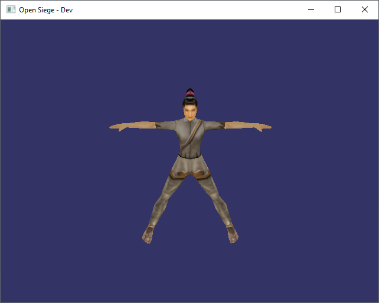
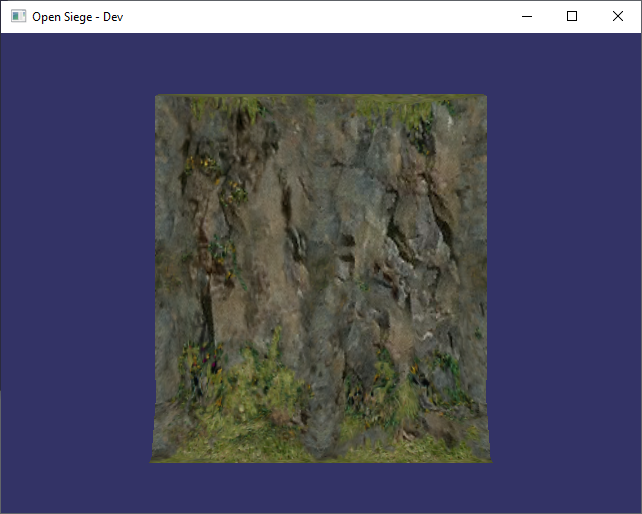
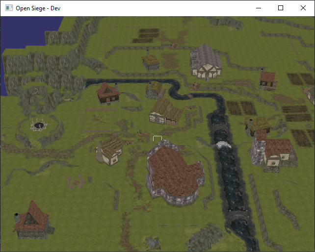

# Open Siege

Open Siege is an open source replacement for the Dungeon Siege engine originally created by Gas Powered Games.

## Getting Started

These instructions will get you a copy of the project up and running on your local machine for development and testing purposes. See deployment notes on how to deploy the project on a live system.

### Prerequisites

```
1. Dungeon Siege (Steam or Original Discs)
2. Dungeon Siege: LOA (Steam or Original Discs)
```

### Building

#### Linux Specific

```
TODO
```

#### Windows Specific

We recommend using [chocolatey](https://chocolatey.org/install) to install the proper RE2C and Bison dependencies.

```
choco install re2c
choco install winflexbison3
```

#### OpenSiege Build

```
1. Checkout repository with: git clone https://github.com/OpenSiege/OpenSiege
2. Create a build folder
3. Run cmake from the build folder
4. Compile
```

#### OpenSiege Command Line Params
When launching OpenSiege will attempt to resolve your bits path automatically. If it cannot be resolved use the ```bits``` command line to pass the directory. This only needs to be done once as that path is written to the user config file.

If you **do not** pass a state to OpenSiege you will get a purple viewport with an outline for the console by default. It's recommended to pass ```--state "RegionTestState"```for a complete map load of ```town_center```.

##### Complete list of Command Line paramaters
```
--bits <path>
--fullscreen <true/false>
--state <GasTestState/SiegeNodeTestState/RegionTestState/UITestState/AspectMeshTestState>
--width <int>
--height <int>
```

#### Expected Test State Output







## Built With

* [OpenSceneGraph](http://www.openscenegraph.org/)
* [spdlog](https://github.com/gabime/spdlog.git)
* [minIni](https://www.compuphase.com/minini.htm)
* [whereami](https://github.com/gpakosz/whereami)
* [ValveFileVDF](https://github.com/TinyTinni/ValveFileVDF)
* [re2c](https://re2c.org/)
* [bison](https://www.gnu.org/software/bison/)

## Authors

Open Siege Team

## License

This project is licensed under the GPLv3 License - see the [LICENSE](LICENSE) file for details

## Acknowledgments

* Gas Powered Games for creating such a fantastic engine and game
* The Dungeon Siege community
