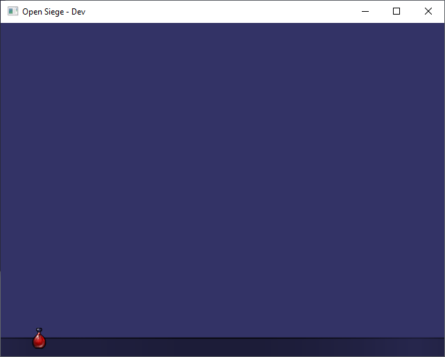

# Open Siege

Open Siege is an open source replacement for the Dungeon Siege engine originally created by Gas Powered Games.

## Getting Started

These instructions will get you a copy of the project up and running on your local machine for development and testing purposes. See deployment notes on how to deploy the project on a live system.

### Prerequisites

```
1. Dungeon Siege (Steam or Original Discs)
2. Dungeon Siege: LOA (Steam or Original Discs)
```

### Building

OpenSiege requires the installation of the [conan](https://conan.io/) package manager. Please refer to the [build instructions](https://docs.conan.io/en/latest/installation.html) for your platform.

```
git clone https://github.com/OpenSiege/OpenSiege.git
cd OpenSiege
mkdir build
cd build
conan install .. -s build_type=Debug
conan install .. -s build_type=Release
cmake ..
```

#### OpenSiege Command Line Params
When launching OpenSiege will attempt to resolve your ```ds-install-path``` path automatically. If it cannot be resolved use the ```ds-install-path``` command line to pass the directory. This only needs to be done once as that path is written to the user config file.

If you **do not** pass a state to OpenSiege you will get a purple viewport with an outline for the console by default. It's recommended to pass ```--state "RegionTestState"```for a complete map load of ```town_center```.

##### Complete list of Command Line paramaters
```
--ds-install-path <path>
--bits <path>
--fullscreen <true/false>
--state <GasTestState/SiegeNodeTestState/RegionTestState/UITestState/AspectMeshTestState>
--width <int>
--height <int>
--log <debug>
--region <worldname:regionname>
```

#### Expected Test State Output





## Built With

* [OpenSceneGraph](http://www.openscenegraph.org/)
* [spdlog](https://github.com/gabime/spdlog.git)
* [minIni](https://www.compuphase.com/minini.htm)
* [whereami](https://github.com/gpakosz/whereami)
* [ValveFileVDF](https://github.com/TinyTinni/ValveFileVDF)
* [re2c](https://re2c.org/)
* [bison](https://www.gnu.org/software/bison/)
* [miniz](https://github.com/richgel999/miniz)

## Authors

Open Siege Team

## License

This project is licensed under the GPLv3 License - see the [LICENSE](LICENSE) file for details

## Acknowledgments

* Gas Powered Games for creating such a fantastic engine and game
* The Dungeon Siege community
