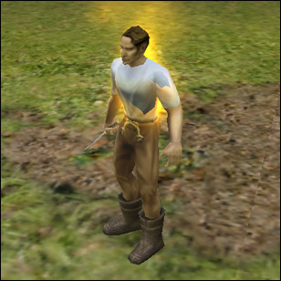
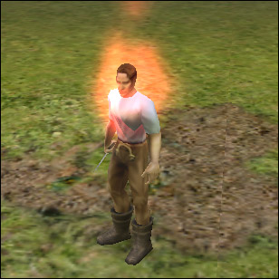

# Siege FX Tutorial #1

## Getting Started

By: Aaron 'Jomdom' Ransley
Created: 1/4/2003

### Introduction

This tutorial will cover a small bit of the language used to create effects in Dungeon Siege.  Siege FX.  Fire from the torches on grimy dungeon walls, healing spells you cast frantically to stay alive, the glow on that new sword you just got from a chicken run, it's all done with Siege FX.  Since I have been working with Siege FX for quite awhile now, and I thought its about time I put together a tutorial for those of you interested in it.

Please take note that I have never written a tutorial before, so don't expect to be glued to your monitor, although I will do my best to be as thorough as possible.

_When I give examples of code,_ they will be in a different font, and in red. _When I show full scripts, they will be formatted for the web, so don’t expect your script to look exactly like mine._

#### Lingo

\- **Base Effect:**  _All Siege FX scripts are built off 22 different base effects. Please check the Resources section at the bottom of this tutorial for a link to a full listing of the base effects._  
\- **Parameter:**  _A parameter is how we tell any of the base effects how to act. They can be used to manipulate various aspects of a base effect; size, speed, color, density, duration, etc._

##### Dissecting the Fire Parameter

We will start the tutorial by learning how to use one of the most versatile of all the Siege FX base effects, fire. This base effect supports many different parameters that allow you to manipulate the way it acts.  Let’s find an effect that keeps it simple for the time being...  Ah yes, this looks like a good effect script:

```
[effect_script*]  
{
      name = fire_pit_fire_small;

      script = [[  

            sfx create fire #TARGET
                 "instant()offset(0,.25,0)scale(1)ts(.5)";
            sfx start #POP;

            ]];
}
```

Alright, let's break it down...

All Siege FX scripts will be structured like so:

```
[effect_script*]  
{
      name = <name of script>;

      script = [[

            ...Code...

            ]];
}
```

With that in mind, let's talk about the base effect created here. We prefix the command to create the base effect with sfx, as we do with almost every command in Siege FX. What we are doing is telling the sfx engine to create fire at a certain place - in this case, at our target.

Next we start the creating the actual parameters that effect the way the base effect acts. We start it with a double quote, followed by these parameters:

\- **instant():** _This parameter causes the_ fire _base effect to be instantly at full flame, and skip any gradual gaining of density and speed._\- **offset(x,x,x):** _This parameter offsets the base effect from the location of it's creation._ _offset(__0,.25,0)_ _causes the flame to be offset along the Y axis (up and down) just a tad._\- **scale(x):** _This is the overall scale of the base effect. It affects the size of the flames more than anything._\- **ts(x):** _This parameter stands for the **T**ime **S**cale of the base effect. It can be used on almost any base effect to speed it up or slow it down._

Then we end it with another double quote and a semi-colon.

Alright, now that we have that done, lets take a look at what it looks like in the game... This effect is part of the main game resources, so you won't need to create a new tank unless you have decided to modify it ahead of time.

**You will need DSMOD.exe for the next few steps, so please make sure you have downloaded the Dungeon Siege Toolkit. You can find a link to the Dungeon Siege Toolkit at the bottom of this tutorial in the Resources section.**

Now, go ahead and fire up DSMOD.exe and get yourself into a map. Bring up the console by pressing the ~ key to the left of the 1 key. Type in: sfx run fire\_pit\_fire\_small.



Ack, you’re on fire! Put yourself out by typing sfx stop scripts.

**Playing with Fire**

Now that we've seen the effect in action, let’s try to modify it a little.

First we will change the color of the flame, then we will add a special parameter to cause it to last longer before fading away, then we will change the size of the flame. Sounds like a lot? Not really, I'll step you though it bit by bit.

When we first created the fire, we added no parameter to manipulate the color, so it used it's default base effect color. Different base effects have different default color values, and the default color for fire is an orange color. We can overwrite this default color by adding a special parameter. This parameter is known as color0. Let’s see take a look at a definition:

\- **color0(x,x,x):** _This parameter is simply a RGB (Red, Green, Blue)  value. The numbers range from 0 to 1, and go out to two decimal places. You might use_ color0(1,.5,.5) _to get a bright red, or_ color0(1,.5,1) _to get a dark-ish purple._

Now that we have that out of the way, you should have a basic understanding of what the color0 parameter does. Let’s put them to work, shall we?

We will need to create a new .gas file for this step... Go ahead and open up Tank Viewer and load up Logic.dsres. Extract ..\\world\\global\\effects\\environmental.gas to a directory of your choice.

If you wish to use the Bits folder, then just extract it to there. Using the Bits folder allows for rapid reloading of scripts while in game; saves a lot of time. The Bits folder is located in ..\\my documents\\dungeon siege\\.

If you wish to use traditional Tank files, this directory will be your Tank's source, so make sure you have the directory tree correct. Open us environmental.gas that you just extracted and search for fire\_pit\_fire\_small, once you have located it, select all of it and cut it (ctrl + x). Select the rest of the document (ctrl + a) and press the delete key. Now, paste the fire\_pit\_fire\_small script back into the now empty document. Give it a new name, by changing the name = fire\_pit\_fire\_small to something else.  Make sure you use no capitals or spaces. Save and close the document. Give it a new name as well. You might have noticed that there are a few other commands in the script that aren't listed above... I stripped down the script so it didn't contain anything we didn't need for the lesson, so you might want to just copy the script from the tutorial.

Now you are probably ready to actually do something. Open up the document again, and find the last parameter, ts(.5) and type in color0(1,.5,.5) directly after it, but not outside the quotation mark. Your script should now look like this:

\[effect\_script\*\]  
{  
      name = fire\_pit\_fire\_small;  
  
      script = \[\[  
  
            sfx create fire #TARGET                 "instant()offset(0,.25,0)scale(1)ts(.5)color0(1,.5,.5)";  
            sfx start #POP;  
  
            \]\];  
}

Save the script, Tank it if you aren't using the Bits folder, and open up DSMOD.exe. If you already have it open, you won't be able to Tank the files, close it down. If it's open and your using Bits, then make sure your not currently flaming, if you are, bring up the console and type sfx stop scripts to stop the effect script from running, then type sfx reload to reload any sfx scripts that have been changed since the last time they were loaded. Once you are done reloading the scripts (you won't need to reload the scripts if you didn't have DSMOD.exe open when editing the script), run your script like you did last time (sfx run yourscriptname), except use your new script name instead of fire\_pit\_fire\_small. You should see a red flame...

Ack! Well, since it isn't actually hurting, you don't need to put it out this time.



Observe the flame... Notice how it fades out so fast? Bah! Let’s change that...

If you have using the Bits folder, Leave DSMOD.exe open this time, minimize it (alt + tab if you’re in full screen). If you are using Tanks, you need to close it. Insert another parameter into your script. Just like you did before, add it before the first parameter, but inside the double quotation mark. Add the parameter, alphafade(.5) parameter to the script. Save the script, go back into DSMOD, stop the scripts, reload the scripts, and play it again. The flame should last about twice as long... Let’s see a definition:

\- **alphafade(****x):** _Using this parameter changes the length of time before the particle is faded from existence, pretty straight forward. The lower the value, the longer it lasts. The default value is 1._

Everything should be going smoothly, so let’s change the size of the flame. Go ahead and edit the script and change the scale(1) parameter to a higher value... See what you get.

It seems that we are done with our tutorial for the time being. Continue to edit the fire base effect by adding more and more parameters. Please check the Resources section below for some useful information.

**Resources**

These are various resources I find _very_ useful.

·  [Dungeon Siege's Main Site](http://www.dungeonsiege.com/index.shtml) (Take a look around. Contains various mod resources, as well as the Dungeon Siege Toolkit)

·  [Game-Editing.net Dungeon Siege Forums](http://www.game-editing.net/forum/index.php?c=3) (If you plan of modifying Dungeon Siege, this is the place to be. Make sure to make use of the search function.)

·  [Siege FX Siege University Course](http://www.dungeonsiege.com/su_212.shtml) (Contains a list of the 22 base effects, a list of all possible parameters for those 22 base effects, and more. A great resource indeed.)

·  [Dungeon Siege Cosmetics](http://dsc.conflict-imminent.com/) (Home of this tutorial.)

·  [Jomdom's E-Mail](mailto:jomdom@hotmail.com?subject=Siege%20FX%20Tutorial) (Feel free to e-mail me with _any_ questions you have about this tutorial.)

**In the Future**

This tutorial was very simple, I’ll admit. Expect more and more advanced tutorials in the future. I will try to explain everything that’s going on in any Siege FX script that is included in any of my tutorials, so as long as you pay attention, and _experiment,_ you won't have to worry about falling behind.

**Credits**

·  Icemage - You have really helped me with the more advanced aspects of Siege FX. I thank you, Icemage.

·  Gas Powered Games - You make a killer effects engine! Great job, can't wait for Dungeon Siege 2's version of Siege FX.